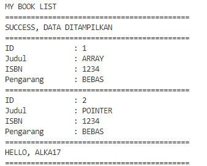

# **Project Rents**

Salah satu project yang dibuat untuk menyelesaikan course di Alterra Academy https://alterra.id

## **Overview**

- CRUD Account, Book (Create, Read, Update, Delete)
- Login Account
- Rent Book (Pinjam dan Mengembalikan Buku)

## **ERD PROJECT RENT**

- ini adalah hasil ERD untuk Project Rent ini.
  

## **Getting Started**

- Silahkan sesuaikan data di file `.env`
- Buka file `MenuUtama.go` di folder `utilities` dan hilangkan tanda `//` untuk auto_migrate pertama kali
- Lalu jalankan cmd dengan perintah `go run main.go` atau `go run .`

## **Hasil Project Rent**

- ini adalah Menu Pertama Project ini.
  
  
  
- ini adalah Menu Register Account.
  
  
  
- ini adalah Menu Login.
  
  
  
- ini adalah Menu Lihat Buku tanpa login.
  
  
  
- ini adalah Menu setelah login.
  
  
  
- ini adalah Menu profil.
  
  
  
- ini adalah Menu melihat profil.
  
  
  
- ini adalah Menu mengubah profil.
  
  
  
- ini adalah Menu Lihat Buku setelah login.
  
  
  
- ini adalah Menu Tambah buku.
  
  
  
- ini adalah Menu Update Buku.
  
  
  
- ini adalah Menu Pinjam Buku.
  
  
  
- ini adalah Menu Daftar Pinjam.
  
  
  
- ini adalah Menu Mengembalikan Buku.
  
  
  
  
## **Tech Stack**

- Golang https://go.dev
- Gorm.io https://gorm.io

## **Contributing**

- Mahmuda Karima https://github.com/BE8-Daka
- Alka Prasetya https://github.com/alkaprasetya

## **Lisence**

© April 2022
